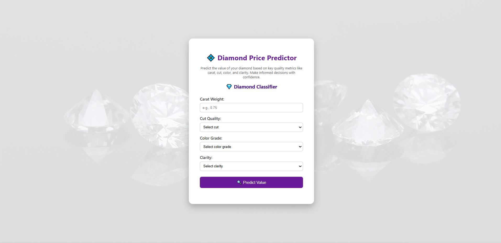

# 💎 Diamond Price Predictor

A simple yet powerful web application that predicts the **price of a diamond** based on its attributes using a pre-trained machine learning model.

## 🔍 Features

- Interactive **web interface** to input diamond attributes.
- Supports both **form-based** and **JSON-based** input (ideal for frontend JS or API usage).
- Returns real-time **predicted price** using a trained regression model.

## 🚀 Inputs

- **Carat**: Weight of the diamond (e.g., `0.1` to `5.0`)
- **Cut**: Encoded as integer (e.g., `0` = Fair, `1` = Good, ..., `4` = Ideal)
- **Color**: Encoded as integer (e.g., `0` = J, ..., `6` = D)
- **Clarity**: Encoded as integer (e.g., `0` = I1, ..., `7` = FL)

> Note: Encoding must match the model’s training configuration.

## 🌐 Usage

- Clone the repo
- Ensure `diamond_model.pkl` is in the root directory
- Run app.py

#🖼️ Preview
Preview of the app:

📸 Screenshot is located at `static/images/price_predictor.jpg`

🧠 Model
The model was trained using regression techniques on historical diamond data, factoring in key physical and grading attributes to predict price accurately.

🤝 Contributions
Feel free to fork this repo and submit pull requests. Feedback and improvements are always welcome!